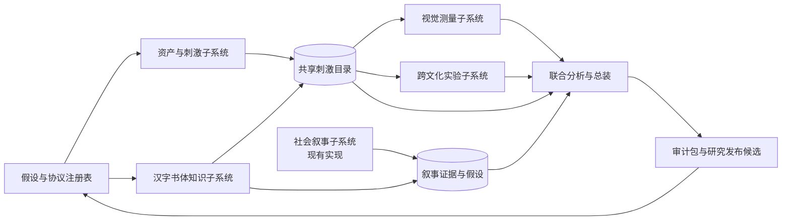
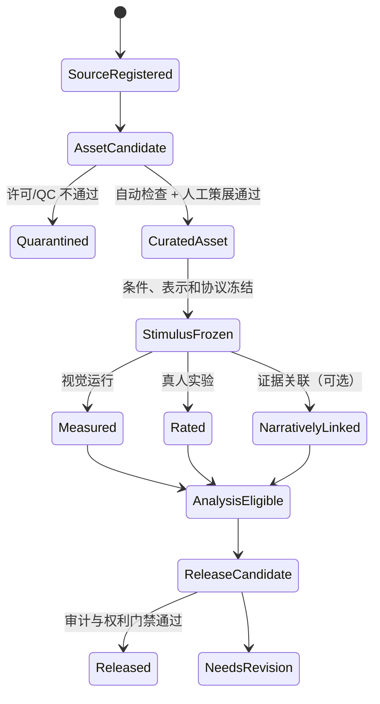

# GLYPH 系统总蓝图与 Agent 任务编排

版本：`0.1.0-draft`
日期：2026-09-04
角色：系统总设计与任务编排
状态：供任务派发使用；不是已完成实现，也不替代冻结研究协议

## 1. 本文的用途

本文先定义 GLYPH 最终要成为怎样的系统，再规定五个实施 Agent 各自完善哪一块、通过什么接口交接、按什么顺序验收。任务的目标不是分别产出五份报告，而是组装出一个可运行、可追溯、可验证、可继续开展真实研究的 GLYPH 系统。

本文是所有任务书的共同上位契约。实施 Agent 必须同时遵守：

1. 用户派发任务时附带的最新指令；
2. 本文；
3. 对应任务书；
4. 仓库内已冻结的 schema、协议和里程碑边界；
5. 现有代码、测试和历史运行事实。

派发新 Agent 时，不要只发送任务名称或文件路径。使用 `docs/agent_tasks/AGENT_START_PROMPTS_zh.md` 中对应的完整首条 prompt；它固定工作区、Python/uv、代理、Git 脏工作树、数据库和验证边界，并要求 Agent 在开始时重新核验实际环境。

若它们冲突，Agent 不得自行掩盖冲突。应停止受影响的实施切片，写明冲突、影响和最小决策选项，等待用户确认。

## 2. 北极星：最终成品是什么

GLYPH 的最终形态是一个**本机优先、中文单研究者、统一入口、模块化后端**的研究工作台。它围绕同一批可追溯刺激，把四条研究线接入一个闭环：

1. **跨文化感知线（WP1）**：不同母语和文字熟悉度的真实受试者如何评价同一刺激；
2. **文化—历史叙事线（WP2）**：不同文字、书体和字体被怎样描述，这些叙事在什么来源、时期和场景中出现；
3. **跨文字视觉形式线（WP3）**：刺激有哪些可复现的视觉形式特征，这些特征和人类评价有什么关系；
4. **汉字书体与字形演化线（WP4）**：汉字内部不同书体的结构、历史和文化联想如何共同影响评价。

最终闭环为：

```text
研究问题/假设
  -> 来源与权利登记
  -> 候选资产采集
  -> 刺激策展与版本冻结
  -> 视觉表示与特征提取
  -> 真实受试者实验
  -> 文化叙事证据
  -> 联合统计分析
  -> 证据审计与发布决策
  -> 下一轮研究问题
```

工程能够运行不等于研究结论成立。最终系统必须把以下三类状态明确分开：

- `engineering_ready`：代码、契约和合成/许可 fixture 已通过；
- `pilot_ready`：研究协议、刺激、问卷和人工审核入口已经冻结，可申请执行小型真实 pilot；
- `research_validated`：真实数据、质量门槛、统计验证和人工审计均通过。

任何 Agent 都不得用前一状态冒充后一状态。

## 3. 已确认的设计决定

1. **产品形态**：一个统一入口，后端保持模块化；不是一个巨型脚本，也不是五个互不相干的工具。
2. **任务范围**：除完善原组员的资产/刺激、理论/CV、跨文化问卷任务外，新增 WP4 汉字书体系统和最终联合分析/总装任务。
3. **奖项范围**：保留现有 5 个奖项，不强求第 6 个。不得为了满足数量抓取低质量或无法合法使用的来源。
4. **执行方式**：带依赖门禁的分阶段执行；允许边界清晰的并行，不允许绕过上游冻结状态。
5. **高风险操作**：真实受试者招募、伦理提交、第三方条款、付费、真实受限平台请求、受限资产公开发布和 Git 历史重写均须用户单独批准。
6. **证据原则**：视觉模型不是审美裁判，奖项不是美的真值，社交热度不是公众偏好，文化叙事不是历史因果，AI Persona 不是真实受试者。

## 4. 系统结构



统一入口只负责导航、状态汇总、运行编排和证据下钻。各模块保留自己的领域逻辑、测试和版本，不共享隐式全局状态。

### 4.1 模块职责

| 模块 | 唯一职责 | 不负责 |
|---|---|---|
| 资产与刺激 | 来源、许可、候选资产、人工策展、规范表示、稳定刺激 ID | 定义审美好坏、收集真人评分 |
| 视觉测量 | 从冻结表示提取可复现的原始视觉特征并报告适用性 | 用规则总分代替真人评价 |
| 跨文化实验 | 多语种问卷、随机化、配额、真实评分契约和实验质控 | 伪造参与者、把母语影响直接删掉 |
| 社会叙事 | 有界采集、人工审核、叙事证据和可检验假设 | 全网流量估计、因果起源证明 |
| 汉字书体 | 书体知识、字符级结构、来源链、候选刺激和专家审核 | 自动宣布历史解释正确 |
| 联合分析与总装 | 统一入口、数据联结、预注册模型、审计、导出与发布门禁 | 改写上游事实、用一个总分压平四线 |

## 5. 唯一拼装契约

### 5.1 现有规范继续作为核心

以下 schema 是现有核心，不得被各任务复制成私有版本：

- `schema/source.schema.json`
- `schema/stimulus.schema.json`
- `schema/visual_features.schema.json`
- `schema/human_rating.schema.json`
- `schema/cultural_narrative.schema.json`
- `schema/social_observation.schema.json`
- `schema/social_run_manifest.schema.json`
- `schema/shared.schema.json`

JSON/JSONL 是规范记录；CSV 是经声明的批量录入或导出投影。任何复杂字段不得靠手工拆逗号解析。

### 5.2 稳定 ID 与对象生命周期



核心 ID 规则：

- `source_id`：一个可追溯来源；URL 或许可变化不能静默覆盖历史。
- `asset_id`：一个原始或派生文件候选；以独立候选资产注册表管理，必须绑定 SHA-256。
- `stimulus_id`：一个已冻结的实验条件。内容、资产、裁切、颜色、画布、版式、表示通道或标准化协议任一变化，都生成新 ID。
- `work_id`：一个作品或设计单元；同一作品的多张图、多个字符或多个派生资产不能被误当成独立样本。
- `style_id` / `font_id` / `content_set_id`：规范书体概念、具体字体实例和冻结内容集；显示名称或别名变化不生成同义对象。
- `glyph_instance_id`：一个字符在特定作品、字体或来源中的具体字形，不与书体概念混用。
- `feature_record_id`：一次视觉特征运行中的一条表示记录。
- `study_id`：一个冻结实验协议和问卷版本。
- `participant_id`：去标识参与者；身份映射不得进入研究仓库。
- `rating_id`：一个参与者对一个刺激的一次有效或待审反应。
- `evidence_id` / `observation_id`：叙事证据和采集观察，不得与评分混用。
- `analysis_run_id`：一个冻结输入快照、模型公式、软件环境和随机种子的分析运行。

现有 schema 尚未覆盖候选资产、参与者背景、问卷版本、书体知识节点和联合分析运行。对应任务可以提出**最小、版本化、带迁移与契约测试**的新 schema；不得原地改变已有字段含义。

### 5.3 奖项图片的双重身份

现有奖项图片首先是**生态候选资产**，不是自动合格的视觉刺激，也不是审美正例。

必须区分：

1. `ecological_candidate`：奖项官网项目图、展板、场景照、封面或 lock-up；可用于策展和生态效度研究；
2. `isolated_wordmark`：经来源核验和人工裁切，仅保留目标字标的刺激；
3. `controlled_font_specimen`：由合法字体、冻结文本和冻结渲染协议生成的控制刺激；
4. `han_style_specimen`：由书体协议和专家审核产生的汉字书体刺激。

禁止把目录名 `logo` 当成 `isolated_wordmark` 的证据。奖项、年份和获奖状态属于元数据或社会变量，不得进入纯视觉算法作为目标标签。

### 5.4 三类图像表示

同一策展资产可产生三个用途不同的表示；它们不是可以互换的“清洗版本”：

| 表示 | 保留内容 | 主要用途 |
|---|---|---|
| `A_layout` | 原始构图、边距、相对位置；只做色彩空间和安全解码规范化 | 平衡、整体比例、章法、生态展示 |
| `B_shape` | 人工确认的目标主体，等比例规范化并记录变换 | 对称、轮廓、结构、笔画、形状比较 |
| `C_ink` | 原始灰度/颜色层次、背景校正、alpha 与曝光信息 | 墨色、纹理、边缘扩散；不适用时明确为空 |

每个表示必须有自己的 `asset_id`、SHA-256、父资产、变换参数、生成软件和 QC 状态。原始文件不可被派生文件覆盖。

## 6. 跨模块交接包

每个实施任务完成时必须生成一个机器可读的 `handoff_manifest.json`，至少包含：

```json
{
  "handoff_schema_version": "1.0.0",
  "task_id": "TASK-NN",
  "producer_version": "...",
  "git_commit": "...",
  "created_at": "...",
  "contract_versions": {},
  "input_snapshots": [],
  "outputs": [],
  "quality_gates": [],
  "known_limitations": [],
  "blocked_human_gates": [],
  "next_task_entrypoints": []
}
```

其中每个输入和输出至少记录逻辑类型、相对路径、SHA-256、记录数、许可/隐私级别和 schema 版本。`git_commit` 必须由执行者在其工作完成后填写；任务 Agent 未经用户要求不得自行提交或 push。

任务间只消费满足以下条件的交接包：

- schema 验证通过；
- 哈希匹配；
- 上游质量门禁为 `passed` 或下游明确接受 `needs_review`；
- 许可、隐私和用途允许；
- 版本在下游声明的兼容矩阵内。

## 7. 数据与存储分层

| 层级 | 内容 | Git 策略 |
|---|---|---|
| `schema/` | 规范、枚举、迁移说明 | 跟踪 |
| `configs/` | 冻结协议和非敏感配置 | 跟踪 |
| `data/templates/` | 最小示例和表头 | 跟踪 |
| `data/fixtures/` | 合成或明确可再分发测试数据 | 跟踪 |
| `data/raw/` | 原图、平台响应、参与者原始数据、受限资产 | 默认忽略，不公开 |
| `data/processed/` | 可重建中间产物和运行目录 | 仅跟踪小型、许可明确的参考运行 |
| `data/releases/` | 通过许可、隐私、QC 和研究门禁的版本化发布 | 经人工批准后跟踪/发布 |
| 本机 SQLite | 队列、运行状态、审核历史和产品操作状态 | 放在被忽略目录；必须可导出规范记录 |

代码许可证永远不替代数据、图片、字体、文献全文或参与者数据的许可证。

## 8. 统一入口与模块化后端

最终总装采用组合式本机应用，而不是把所有领域表塞入现有社会叙事数据库。

建议入口：

```text
uv run glyph-workbench serve --catalog-database <local-catalog.sqlite3> [--social-database <glyph-social.sqlite3>]
```

若为兼容早期实现保留 `--database`，它只能作为 `--catalog-database` 的已弃用别名，不能根据文件内容猜测数据库角色。社会叙事数据库必须使用独立参数且不得在总装启动时自动迁移。

统一入口至少提供：

- 系统首页：四线状态、协议版本、待处理人工门禁、最近运行；
- 来源与权利：来源、许可、可再分发状态和受限资产位置；
- 刺激库：候选、策展、三通道表示、QC、稳定 ID 和版本比较；
- 视觉测量：运行、失败、特征字典、表示和敏感性报告；
- 跨文化实验：研究协议、问卷版本、随机化、配额和去标识导出；
- 社会叙事：复用现有采集、审核、分析和证据下钻能力；
- 汉字书体：知识节点、来源链、字形候选和专家审核状态；
- 联合分析：冻结输入、模型、诊断、不确定性、证据边界和导出；
- 审计中心：哈希、schema、许可、隐私、缺失、人工关卡和发布阻断项。

模块通过 Python 服务接口、规范文件和只读查询组合。不得跨模块直接修改私有数据库表。跨模块写入只能通过模块公开服务或规范导入器。

## 9. 联合分析的因果与统计边界

最终系统至少能构造以下相互区分的数据层：

- `x_visual`：冻结视觉特征；
- `x_script_style`：文字系统、书体和字体实例；
- `x_participant`：母语、文字熟悉度、设计/书法训练等去标识协变量；
- `x_context`：盲评/带标签实验条件、品牌品类等预先定义条件；
- `x_narrative`：在相容时间窗和来源边界内形成的叙事暴露或证据摘要；
- `y_rating`：真实受试者的美观、高级、现代、可信、易读、陌生和品牌适配评分。

最低模型族包括：

1. `M0: y ~ script/style + participant controls`；
2. `M_visual: y ~ visual features + script/style + participant controls`；
3. `M_context: y ~ visual + script/style + context + interactions + controls`；
4. 仅在时间和构念成立时探索 `M_narrative: y ~ ... + narrative variables`。

参与者和刺激至少作为分层/随机效应处理。母语不是要从数据中“删除”的噪声，而是要通过平衡设计、协变量和交互项估计的研究因素。模型比较必须报告不确定性、缺失、有效样本、共线性、分组切分和失效条件。没有随机化或时间顺序支撑时不得作因果陈述。

## 10. 人工门禁

以下动作必须由 Agent 停止并提交门禁包，等待用户明确批准：

| 门禁 | Agent 可准备 | 未经批准禁止 |
|---|---|---|
| `GATE-RIGHTS` | 许可清单、风险分类、迁移方案 | 公开受限资产、推定默示授权 |
| `GATE-HISTORY` | blob 清单、历史重写演练和团队通知 | force push、删除远端历史 |
| `GATE-ETHICS` | 研究方案、数据管理计划、同意文本草案 | 代表机构提交伦理申请或声称获批 |
| `GATE-PARTICIPANTS` | 合成 dry-run、招募与配额方案 | 招募、联系或收集真实受试者数据 |
| `GATE-EXPERT` | 专家审核包和候选列表 | 伪造专家结论或替专家通过样本 |
| `GATE-TERMS` | 官方条款链接、成本和数据流说明 | 接受条款、登录、付费或首次受限请求 |
| `GATE-RELEASE` | 发布候选、脱敏和审计报告 | 对外发布数据、模型结论或应用 |

## 11. 五个实施任务及所有权

| 顺序 | 任务 | 主要所有权 | 上游 | 下游 |
|---|---|---|---|---|
| 1 | `01_asset_stimulus_system_task_zh.md` | 来源、许可、5 奖项候选、字体、策展、三通道刺激 | 现有仓库 | 视觉、问卷、WP4、总装 |
| 2 | `02_visual_measurement_system_task_zh.md` | 8 维/10 指标协调、原始特征、CV 工程化、稳定性 | 任务 1 的 fixture/契约 | 问卷解释、联合分析 |
| 3 | `03_cross_cultural_experiment_task_zh.md` | 多语种问卷、随机化、配额、真人评分契约 | 任务 1 的冻结刺激；任务 2 字典 | 联合分析 |
| 4 | `04_han_style_knowledge_task_zh.md` | WP4 知识图谱、受控汉字刺激、专家审核 | 任务 1 契约；任务 2 特征接口 | 问卷、叙事、联合分析 |
| 5 | `05_joint_analysis_workbench_task_zh.md` | 统一入口、跨线联结、模型、审计与发布门禁 | 任务 1–4 + 现有 WP2 | 最终研究系统 |

任务编号表示门禁依赖，不表示所有代码必须严格串行。任务 2 可先用许可 fixture 修复 CV；任务 3 可先冻结问卷协议和合成流程；任务 4 可先建立知识本体。但它们不得在任务 1 冻结刺激接口前生成正式跨任务 release。任务 5 最后执行。

## 12. 执行波次与停止规则

### Wave 0：任务派发

- 用户选择 Agent，并把本文与对应任务书一并派发。
- 每个 Agent 先检查 Git 状态、远端差异、已有实现和用户修改。
- Agent 不得直接 pull 覆盖本地修改，不得自行重写历史。

### Wave 1：基础契约与治理

- 任务 1 先冻结候选资产、许可、刺激和三通道接口。
- 任务 2、3、4 可以并行完成不依赖正式数据的 schema 提案、fixture 和领域测试。
- 任一 schema 变更须附兼容性矩阵、迁移器和契约测试。

### Wave 2：领域实现

- 任务 1 交付许可 fixture 和策展后刺激。
- 任务 2 在冻结表示上提取视觉特征。
- 任务 3 在冻结刺激和字段字典上形成 pilot-ready 实验。
- 任务 4 形成专家待审的 WP4 候选和知识记录。

### Wave 3：人工关卡

- 用户决定资产历史处理方式；
- 权利审查通过可用集合；
- 专家审核 WP4 候选；
- 伦理/真实 pilot 单独批准。

Agent 不得用合成数据绕过这些关卡并声称完成真实研究。

### Wave 4：联合总装

- 任务 5 只接入通过契约检查的交接包；
- 用许可明确的 fixture 和合成评分完成端到端产品验收；
- 真实分析只有在真实评分和相应门禁通过后才能解锁。

## 13. 全局完成定义

GLYPH 系统只有同时满足以下条件，才能称为“成品”：

1. 单条 `stimulus_id` 可从来源与许可追溯到原始/派生资产、视觉特征、问卷呈现、评分和分析输入；
2. 每个研究运行都有不可变协议快照、输入哈希、软件环境、随机种子、失败记录和输出哈希；
3. 统一入口能启动、导航、运行许可 fixture、查看失败、下钻证据和导出审计包；
4. 四条研究线各自保留证据边界，同时能进入预先声明的联合模型；
5. 受限资产、真实参与者数据和平台原始数据不因统一入口而被错误公开；
6. 所有自动标签、代理变量和模型输出与人工确认事实分层保存；
7. 合成端到端测试通过，真实研究状态如实显示为未执行、待审核或已验证；
8. 发布命令在任何许可、隐私、QC、协议或人工门禁未通过时机械阻断；
9. 文档能让新的研究者在锁定环境中复现许可 fixture 的完整链路；
10. 最终报告分别说明工程完成度、pilot 就绪度和研究验证度，不使用一个模糊的“完成”覆盖三者。

## 14. 全局非目标

- 不建立多租户、组织账户或复杂权限系统；
- 不把所有原始大文件塞进 Git；
- 不训练一个没有人评校准的“高级感总分器”；
- 不以奖项标签训练美丑分类器；
- 不让通用 LLM 代替真实受试者、书法专家或版权判断；
- 不把四条线压成一个不可解释的总指数；
- 不为了界面统一而重写已验证的社会叙事采集核心；
- 不把未来可能需要的功能提前扩成云平台或多用户 SaaS。

## 15. 每个 Agent 的最终报告模板

每个任务完成或遇到人工门禁时必须停止，并提交：

1. 实际完成的职责范围；
2. 修改的关键文件和公开接口；
3. schema/数据库/配置版本变化及迁移；
4. 输入、输出、记录数和哈希；
5. 执行的测试、命令和结果；
6. 产品行为和界面验收；
7. 研究有效性边界；
8. 未完成、降级、失败和外部阻塞；
9. `handoff_manifest.json` 路径及下游入口；
10. 等待用户批准的人工门禁；
11. 是否逐条满足任务书完成定义；
12. 明确停止声明，不自动进入下一任务。
